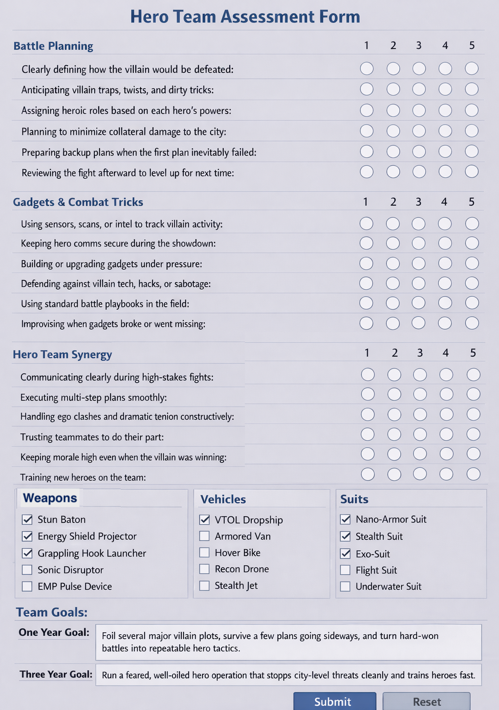

# Postgres Workshop

## Prerequisites

- [Docker Desktop](https://www.docker.com/products/docker-desktop/) (running)
- [Node.js 20+](https://nodejs.org/)
- [Git](https://git-scm.com/downloads)

## Install

```bash
cd frontend
npm install
```

## Run

Make sure Docker Desktop is running, then:

```bash
docker compose up --build
```

## Access

- **App**: http://localhost:3000
- **pgweb** (database UI): http://localhost:8081

## Workshop

You have been hired by a superhero organization to create reports on their team's performance. Their superheroes have all taken an assessment, and now we have a database with their results. Here are your objectives.

1. [Get Best and Worst Questions by Category](docs/best-worst-questions.md)
2. [Get the top Weapon, Vehicle and Suit used](docs/top-tools-used.md)
3. [Search one year goals](docs/search-goals.md)
4. Extra credit - Find the top performing superhero
5. Extra credit - Add a bar graph of average Mission Planning, Team Dynamics, Tech and Tactics scores
6. Extra credit - Add a dropdown to filter by superhero, so this report is individual rather than average results
7. Extra credit - Add a line under each goal with the name of the superhero who had that goal


